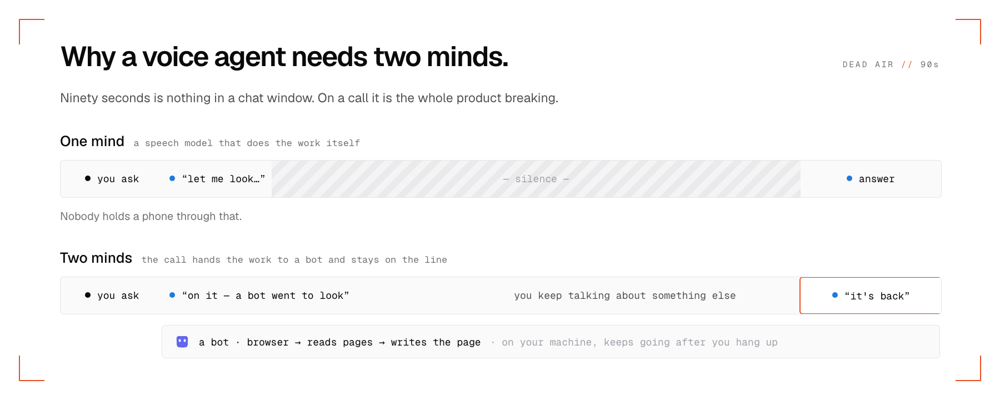
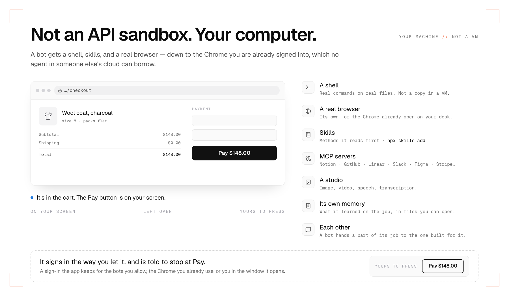
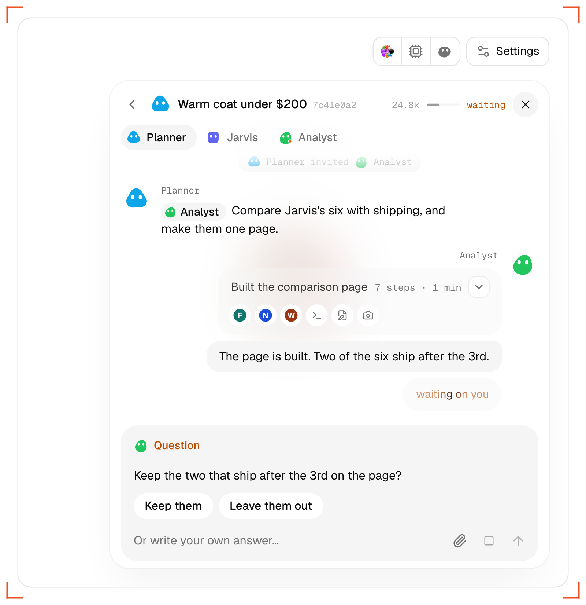
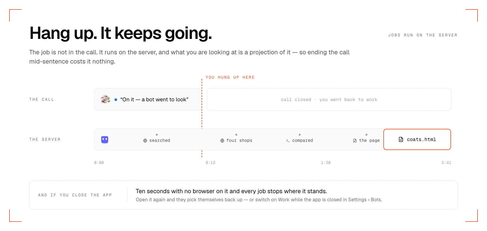

# How it works

What each part does, so you can guess what will happen before you say it.

## The call

A call runs on two models: **GPT-Live 1** holds the conversation, and a Responses model (**GPT-6 Luna** by default) thinks and uses tools behind it. The voice keeps listening while the backend works.



- **Quick things, she answers herself.** She reads and writes your memory and runs one shell command at a time: open a file, check a folder, play something.
- **Everything else goes to a bot.** She hands it over and keeps talking. A speech model that ran a browser itself would go silent for minutes.
- **When a job comes back,** she tells you in a sentence. A file it made shows up in the corner of your screen, and a question it asks shows up as buttons.

Settings › Thursday picks the voice, the backend model and its reasoning, web search, the wake word (on once the first run turns the microphone on, otherwise off until you switch it on) and the hotkey (off until you switch it on), and whether she rings your screen when a job ends.

On your OpenAI API key, the voice is billed per active minute, silence included, and the backend per token. Signed in to a GPT Subscription, both run on your ChatGPT plan instead: the voice is **GPT-Live 1 Codex**, the one the Codex CLI's `/voice` speaks with, and the app runs the backend for it.

## Without your voice

- **Writing.** Press `@`, or the @ on the pill, pick her, and type: a call in writing, with the same memory, tools and bots, no microphone, and nothing billed by the minute. It runs on a ChatGPT sign-in when you have one, else on your OpenAI key, and you can pick another model for it.
- **From your phone.** Connect Telegram, Discord or Slack in Settings › Phone and write to her there while the app runs on your computer, or give her a mailbox of her own and email her. The app connects out to the chat service or mailbox; nothing on your computer is opened to the internet. One person is let in per service: on a chat app you allow them on the computer's screen when the code it shows is the one their phone was sent, and by email you name your own address, and only mail its mail service vouches for (DKIM and DMARC) reaches her. A page a bot made — a report, a deck, a design — arrives as pictures you can read in the chat; the page itself stays on your computer.

## Bots



A bot is a text model from any provider you added, with:

- a **shell** in a workspace folder
- a **real browser** — its own, or the Chrome you already use
- **your files** — it reads anywhere and writes where your user can; only its file tool is kept out of the app and the workspace root ([SECURITY.md](../SECURITY.md))
- **skills**, methods it reads before it starts
- **MCP servers** you connected
- a **studio** for images, video, speech, and transcription
- **each other**: the bot a job went to hands parts to the others, and they answer it



The first run lets you pick a few starter bots; more are ready in Settings › Bots, or make your own with a name and one sentence about what it is for. That sentence is how Thursday decides who gets a job. Switch a bot off without deleting it.

A job ends in the thing you asked for and a short report. Anything longer than a few lines is a file in `artifacts/`. When only you can do something — sign in, choose between two real options — the bot sets it up, asks, and waits. It is told never to press Pay: a purchase stops on the last screen, left open for you. That is an instruction the model follows, not a lock ([SECURITY.md](../SECURITY.md)).

Each bot keeps its own memory as files you can open from its page. When a job is done, each bot that worked in it looks back once and keeps what it learned about working, such as the way round a site that showed prices only in the local currency, so the next job like it goes straight through. A job that taught nothing leaves nothing.

## Jobs outlive the call



- A job runs on the local server, not in the call. Hang up and it keeps going.
- Every step is saved, so a job that stopped to ask picks up where it left off, and you can read the whole thread.
- Close the app's tab and jobs keep running for as long as Thursday runs on your computer; routines start with nothing open, and a connected phone hears when a job finishes. Quit the server and a running job waits for you to press Continue.
- A model call that fails is retried once. After that, the job waits for you.

## Memory

Memory is a set of notes about you, one fact per line: your name, your language, the people you mention, the rules you give her. A few notes go into every call.

Open any note in Settings › Memory to see exactly what she knows. To change it, type what changed and watch each edit land. Bots read your memory but never write it.

## Where your data lives

```text
~/.thursday
├── local.db          calls, memory, bots, jobs, keys
├── .env              the key the saved keys are sealed with
├── .sign-ins/        the sites you signed in to, one file per account
├── app/              on a Mac, the copy that runs in the background
└── .ai-workspace
    ├── artifacts/    finished work, a folder per bot
    ├── projects/     code and longer-lived projects
    ├── bots/         each bot's memory and skills of its own
    └── .agents/      skills you installed
```

When you run from source, the same files live in the checkout. The server listens only on `127.0.0.1`, and there is no login — see [SECURITY.md](../SECURITY.md).

For contributors: [AGENTS.md](../AGENTS.md) maps the code.
